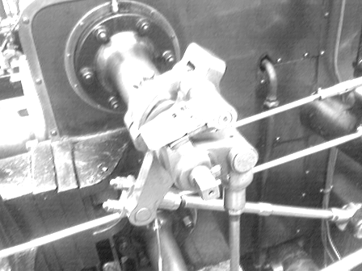

# Convolution Neural Network(In Complete)

CNN's are very powerfull deep learning tools. These are the the main features of CNN's which make them to prefer over [**Fully Connected Neural Networks**](https://github.com/girishdhegde/nn-lab):

1.  Spatially **local** pattern awareness.
2.  **Less parameters** due to **sparse** connections and **Parmeter sharing**.
3.  **Translational** Invariance.
4.  Capturing Global view from **receptive fields**.

 This repo. contains implementation of CNN from **scratch in pure python and numpy**.
***
## Highlights:
***

1.  Modular: Seperate **conv2d, view, flatten layer**  classes with their own **forward** and **backward** functions.
2.  Supports **strided convolution**
3.  Supports **padding**
4.  Supports:
    
    *  Activations: Linear, **ReLU**, Sigmoid([Why we need activations](https://stackoverflow.com/a/63543274/14108734))
    
    *  Loss: MSELoss, BCELoss
    
    *  [Optimizers](https://github.com/girishdhegde/optimizers): SGD, Momentum SGD, RMSprop, **Adam**

To Do:
**Visualization**:
 itr49
## Here's How To Use/Run The Code:
***
To use convolution layer

```
import numpy as np
from conv2d import Conv2d, MSELoss
# layer init
my_conv = Conv2d(in_ch, out_ch, k_sz, stride, bias=False, padding=(0, 0), act=act, optim=optim)
```

To test the code for learning edge detection:

`python edge.py`

 
